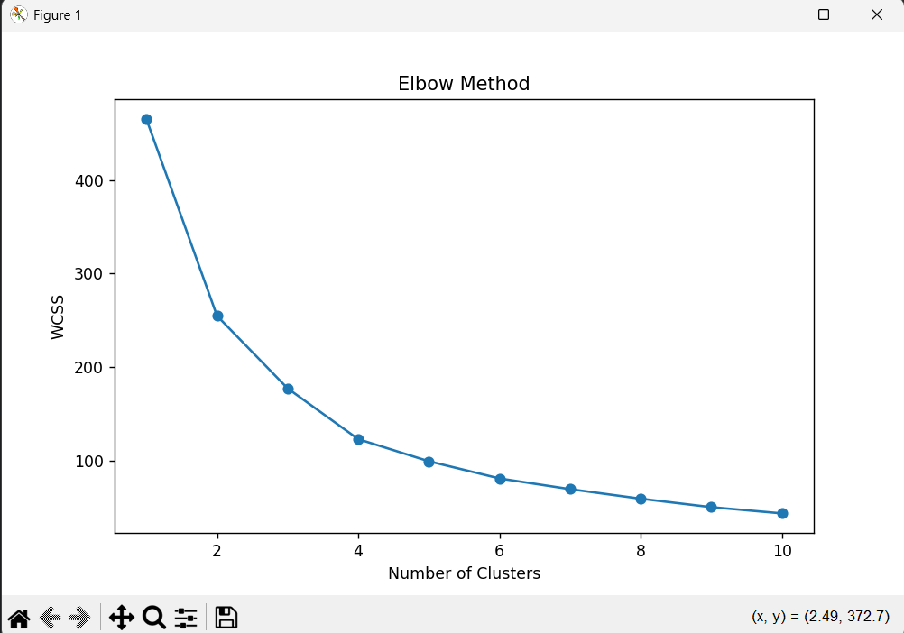
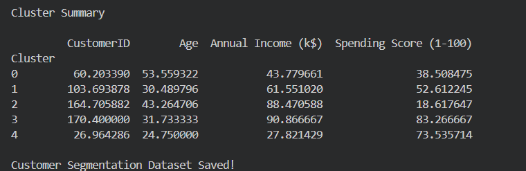
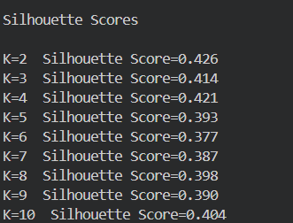

# Customer Segmentation using K-Means Clustering & PCA

## Project Overview

This project was completed as part of the DecodeLabs Data Science Industrial Training Program (Week 3).

The objective of this project is to segment customers into meaningful groups using Unsupervised Machine Learning techniques. K-Means Clustering was used to identify customer segments, while PCA (Principal Component Analysis) was applied for dimensionality reduction and visualization.

---

## Technologies Used

- Python
- Pandas
- NumPy
- Matplotlib
- Seaborn
- Scikit-Learn

---

## Dataset

Mall Customers Dataset

Features Used:
- Age
- Annual Income (k$)
- Spending Score (1-100)

---

## Project Workflow

1. Data Loading
2. Data Exploration and Analysis
3. Feature Selection
4. Data Standardization using StandardScaler
5. PCA (Principal Component Analysis)
6. Elbow Method
7. Silhouette Score Evaluation
8. K-Means Clustering
9. Customer Segmentation Visualization
10. Cluster Analysis

---

## Visualizations

### Elbow Method



### Customer Segmentation


### Cluster Summary



### Silhouette Scores



---

## Key Insights

- Identified distinct customer groups based on age, income, and spending behavior.
- Applied PCA to reduce dimensions and improve visualization.
- Used Elbow Method and Silhouette Score to determine the optimal number of clusters.
- Generated customer segments that can support targeted marketing strategies.

---

## Output

The final segmented dataset is saved as:

customer_segments.csv

Each customer is assigned a cluster label representing their segment.

---

## Project Structure

```text
Project 3
│
├── Mall_Customers.csv
├── Customer_Segmentation_Project3.py
├── customer_segments.csv
├── README.md
└── Screenshots
    ├── Elbow_Method.png
    ├── Customer_Segmentation_using_k_means.png
    ├── Cluster_Summary.png
    └── Silhouette_Scores.png
```

---

## Author

Aryan Tiwari

B.Tech Computer Science Engineering

